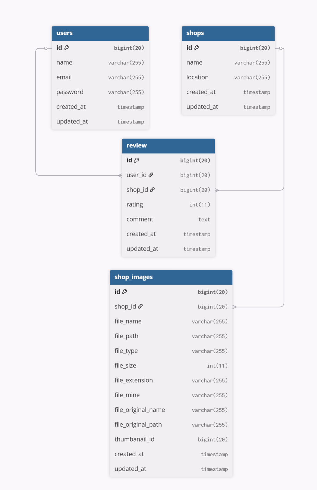

# コーヒーショップレビューのDB設計書

## 1.概念設計
| 項目 | 説明 |
|:----|:---|
| ユーザー（User） | ログインやレビュー投稿する人 |
| お店（shop） | コーヒーショップの情報 |
| レビュー（Review） | 各店舗のレビュー |
| お店画像（shop_image） | コーヒーショップの画像 |

### 1-2.エンティティの関係
ユーザーとレビュー：1人のユーザーは複数のレビューを投稿することができる（1対多）。

お店とレビュー：1つのお店に複数のレビューを投稿することができる（1対多）。

お店とお店画像：1つのお店に複数の画像を投稿することができる（1対多）。

## 2.論理設計
テーブル一覧

|usersテーブル|詳細
|:----|:---|
|id (主キー)|プライマリキー|
|name|ユーザー名|
|email|メールアドレス|
|password|パスワード|
|created_at, updated_at|作成日時、更新日時|

================================

|shopテーブル|詳細
|:----|:---|
|id (主キー)|プライマリキー|
|name|店舗名|
|location|住所|
|description|店舗の詳細説明|
|created_at, updated_at|作成日時、更新日時|

================================

|reviewテーブル|詳細
|:----|:---|
|id (主キー)|プライマリキー|
|user_id|レビューを投稿したユーザーID（usersテーブルの外部キー）|
|shop_id|レビュー対象の店舗ID（shopテーブルの外部キー）|
|rating|評価（1~5の整数）|
|comment|レビュー内容|
|created_at, updated_at|作成日時、更新日時|

================================

|shop_imagesテーブル|詳細
|:----|:---|
|id (主キー)|プライマリキー|
|shop_id|画像が関連する店舗のID（shopテーブルの外部キー）|
|file_name|画像の名前|
|file_path|画像のパス|
|file_type|画像の種類|
|file_size|画像のサイズ|
|file_extension|画像の拡張子|
|file_mine|画像のMIMEタイプ|
|file_original_name|画像のオリジナル名|
|file_original_path|画像のオリジナルパス|
|thumbnail_id|サムネイル画像のID|
|created_at, updated_at|作成日時、更新日時|

## 3.物理設計
・usersテーブル
|名前|型
|:----|:---|
|id|bigint(20) UNSIGNED AUTO_INCREMENT|
|name|varchar(255)|
|email|varchar(255)|
|password|varchar(255)|
|created_at|timestamp|
|updated_at|timestamp|

================================

・shopsテーブル
|名前|型
|:----|:---|
|id|bigint(20) UNSIGNED AUTO_INCREMENT|
|name|varchar(255)|
|location|varchar(255)|
|description|text|
|created_at|timestamp|
|updated_at|timestamp|

================================

・reviewテーブル
|名前|型
|:----|:---|
|id|bigint(20) UNSIGNED AUTO_INCREMENT|
|user_id|bigint(20) UNSIGNED|
|shop_id|bigint(20) UNSIGNED|
|rating|int(11)|
|comment|text|
|created_at|timestamp|
|updated_at|timestamp|

================================

・shop_imagesテーブル
|shop_imagesテーブル|詳細
|:----|:---|
|id|bigint(20) UNSIGNED AUTO_INCREMENT|
|shop_id|bigint(20) UNSIGNED|
|file_name|varchar(255)|
|file_path|varchar(255)|
|file_type|varchar(255)|
|file_size|int(11)|
|file_extension|varchar(255)|
|file_mine|varchar(255)|
|file_original_name|varchar(255)|
|file_original_path|varchar(255)|
|thumbnail_id|bigint(20)|
|created_at|timestamp|
|updated_at|timestamp|

  

